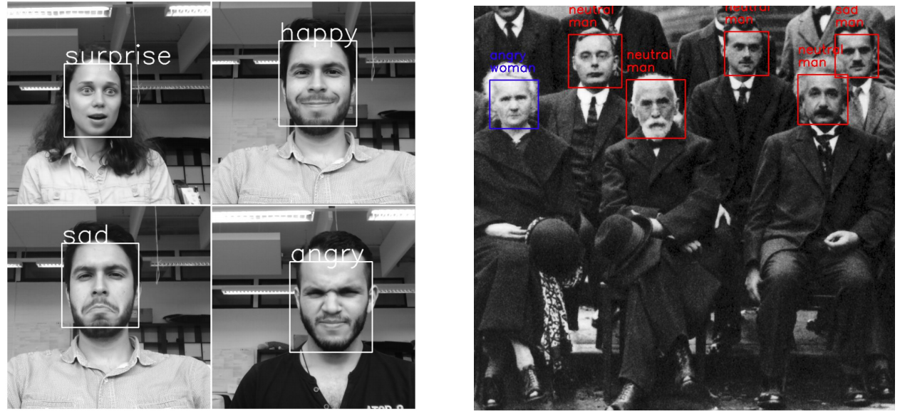

# Gender and Emotion Classifier with Deep Learning
##### A classifier that uses realtime webcams to detect faces and extrapolate emotions and gender of faces
&nbsp;
[](https://nodesource.com/products/nsolid)      [](https://nodesource.com/products/nsolid)




Guided back-prop


Real-time demo:
<div align='center'>
  
</div>

Real-time face detection and emotion/gender classification using fer2013/IMDB datasets with a keras CNN model and openCV.
* IMDB gender classification test accuracy: 96%.
* fer2013 emotion classification test accuracy: 66%.

## Inspiration
This project is greatly inspired from the Sandberg Paper called Google FaceNet, thereby harnessing Google's whitepaper implementations and applying them for real world production ready use cases and environments as a robust solution

### Technology

Oversight uses a number of open source projects to work properly:

* [Tensorflow] - A google open-source ML framework
* [Python] - awesome language we love

### Environment Setup

##### This was built on Windows 10.

These were the pre-requisities :

##### NVIDIA CUDA Toolkit
* [CUDA] - parallel computing platform and programming model developed by NVIDIA for general computing on graphical processing units (GPUs). Download and Install all the patches. During install, choose Custom and uncheck the Visual Studio Integration checkbox.

##### Download cuDNN
* [cuDNN] - The NVIDIA CUDA® Deep Neural Network library (cuDNN) is a GPU-accelerated library of primitives for deep neural networks. Create a NVIDIA developer account to download.

##### Set Path :
Add the following paths,
&nbsp;
C:\Program Files\NVIDIA GPU Computing Toolkit\CUDA\v9.0\bin
&nbsp;
C:\Program Files\NVIDIA GPU Computing Toolkit\CUDA\v9.0\libnvvp
&nbsp;
C:\Program Files\NVIDIA GPU Computing Toolkit\CUDA\v9.0\bin\extras\CUPTI\libx64

##### Install [Anaconda](https://www.anaconda.com/download/) with 3.6 x64

```sh
$ conda update conda
```

##### Run package installer

```sh
$ pip install -r requirements.txt
```


## Instructions

### Run real-time emotion demo:
```
$ python3 video_emotion_color_demo.py
```
### Run real-time guided back-prop demo:
```
$ python3 image_gradcam_demo.py
```
### Make inference on single images:
```
$ python3 image_emotion_gender_demo.py <image_path>
```
e.g.
```
$ python3 image_emotion_gender_demo.py ../images/test_image.jpg
```

### To train previous/new models for emotion classification:


* Download the fer2013.tar.gz file from [here](https://www.kaggle.com/c/challenges-in-representation-learning-facial-expression-recognition-challenge/data)

* Move the downloaded file to the datasets directory inside this repository.

* Untar the file:
```
$ tar -xzf fer2013.tar
```
* Run the train_emotion_classification.py file
```
$ python3 train_emotion_classifier.py
```
### To train previous/new models for gender classification:

* Download the imdb_crop.tar file from [here](https://data.vision.ee.ethz.ch/cvl/rrothe/imdb-wiki/) (It's the 7GB button with the tittle Download faces only).

* Move the downloaded file to the datasets directory inside this repository.

* Untar the file:
```
$ tar -xfv imdb_crop.tar
```
* Run the train_gender_classification.py file
```
$ python3 train_gender_classifier.py
```


### Todos

 - Optimize Further to increase speed
 - Implement Docker and Jenkins based deployment

License
----

Public

   [Tensorflow]: <https://www.tensorflow.org/>
   [Python]: <https://www.python.org/>
   [Google's FaceNet]: <https://arxiv.org/abs/1503.03832>
   [Anaconda]: <https://www.anaconda.com/download/>
   [CUDA]: <https://developer.nvidia.com/cuda-90-download-archive?target_os=Windows&target_arch=x86_64&target_version=10&target_type=exelocal>
   [cuDNN]: <https://developer.nvidia.com/compute/machine-learning/cudnn/secure/v7.0.5/prod/9.0_20171129/cudnn-9.0-windows10-x64-v7>

  
